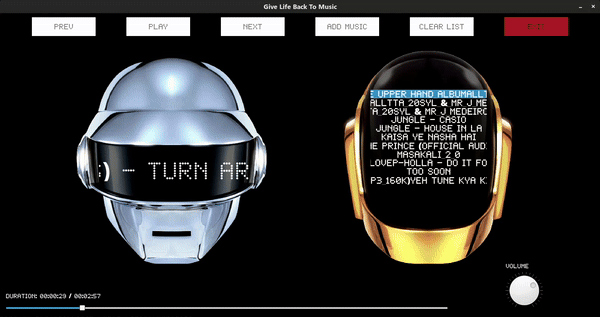

# Daft Punk Themed Music Player 🤖🎵

## Introduction
Hey, hey, hey! It's your favorite out-of-touch bro dropping something cooler than being the Michael Jordan of being in your room. Introducing the **Daft Punk Themed Music Player**. This ain't just any music player; it's like if Daft Punk decided to host a party in your device. It's the ultimate chill, but with a twist of tech.

## Features
- **Aesthetic Daft Punk Interface**: Because normal is overrated and we're all about that secret third thing. 
- **Dynamic Playlists**: Tailored to be as unpredictable as my life choices but in a good way.
- **Recommendation System**: It's like having a friend who knows you’re into Daft Punk but also gets you don't want to push people away with too much of it.
- **Unintegrated Recommendation System**: Yeah, it's there, lurking in the background, like my delusional optimism.
- **Original Idea Overload**: Initially, it was like "Let's recommend a Daft Punk song for every mood," but then we thought, why limit to Daft Punk? Let's not make it a Taxi Driver summer.

## Upcoming Features
- **GUI Integration for Recommendation System**: It's like it's almost there but decided to take a detour. We're bringing it back, though. Soon.
- **More Music, Less Daft Punk Overkill**: We're expanding beyond Daft Punk because, let's be honest, too much of a good thing is my entire social strategy.

## Conclusion
This is it, folks. The music player that's in its “we’re all gonna make it” era. It's like that friend who's chill but also slightly out of touch with reality. If you've ever felt like your music player just doesn't get your deep, indescribable sadness or your occasional delusional vibes, this is for you. Stay out of touch, but in tune. Love you all (only my followers).

P.S. If you don't use this player, it's like seeing me lying in the street covered in blood and just walking away. No pressure.

---
*Disclaimer: May not cure existential dread but will definitely make it sound better.*

